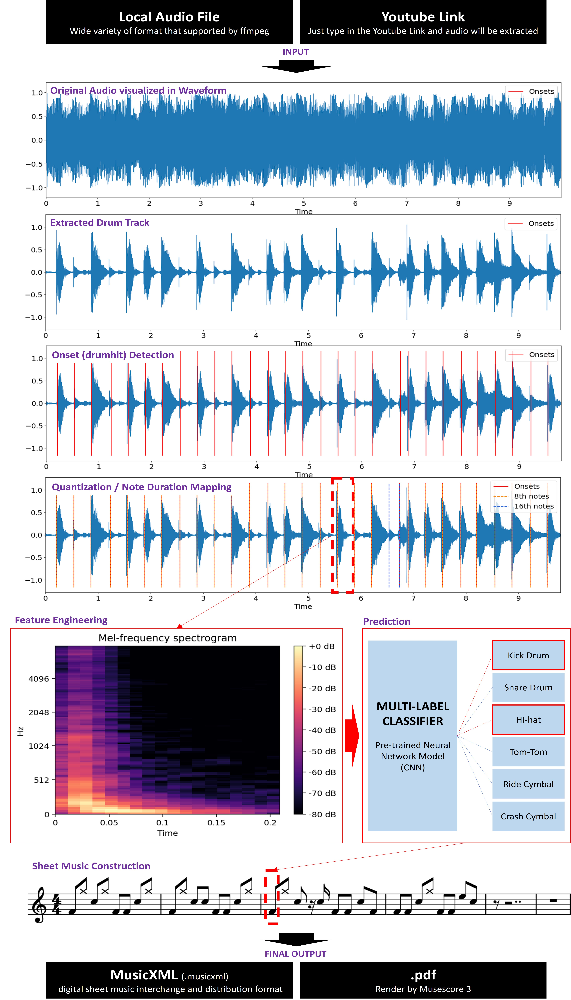
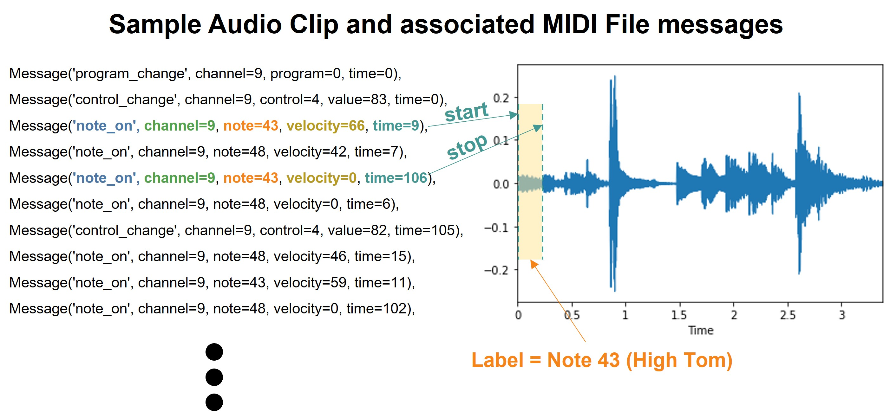
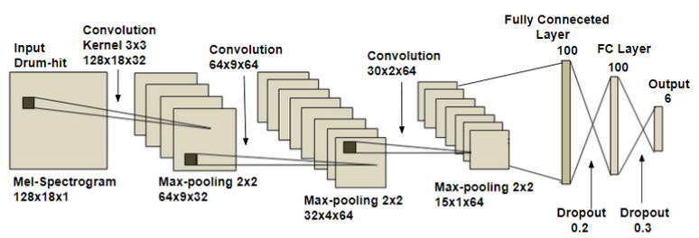
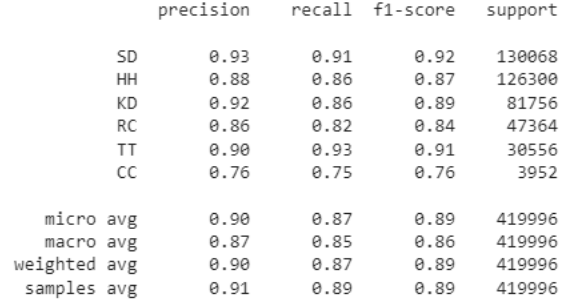

# The AnNOTEators Capstone Project
Greetings! This is our Summer 2022 Capstone Project for the Master of Applied Data Science at the University of Michigan School of Information. Our goal is to predict drum notes from audio to create sheet music. The team consists of Christopher Brown, Stanley Hung, and Severus Chang.  

# Introduction
Sheet music is a fundamental and important tool for most musicians. It makes individuals much faster and more efficient in preparing to play music. Nowadays, obtaining properly written sheet music of a song could be troublesome unless that song is particularly popular and in the worst case a musician needs to transcribe it themselves. The AnNOTEators' project aims to help with this situation by leveraging neural networks to automatically transcibe each instrument part in a song. Due to the 8 week time limit for this project, the team decided to focus on transcribing drum notes and produce drum sheet music from a given song, rather than handle all instrument layers. You can find more details of the pipeline and framework in the [How does this work?](https://github.com/cb-42/AnNOTEator#how-does-this-work) section. We may expand the scope of this project to cover more instrument components in the future.

It is important to check out the [Known issues and recommendations for future work](https://github.com/cb-42/AnNOTEator#known-issues-and-recommendations-for-futurework) sections for more information about factors to be aware of when using this package.

To learn more about the technical details of this project, please visit our [blog post](https://medium.com/@stanley90526/b0fce4bb3200).

# How does this work?



For a more detailed explanation of each step, please visit our [blog post](https://medium.com/@stanley90526/b0fce4bb3200).

# Preparing audio input
The pipeline accepts either a local audio file (in various audio formats supported by ffmpeg) or a YouTube link to the music video of your choice. Please note that:

- The pipeline expects a song that has a drum part. 
- Higher audio input quality yields higher output quality. 
- We highly recommend using the original version of the song as an input to ensure noiseless signals and a clean signal. Other versions (e.g., live performance) is not recommended.


# Getting Started

## Software Setup

There are a few ways to install and use the code, models, and environments we've developed.

Our requirements.txt file has a list of the Python library dependencies needed to run our Python scripts and Jupyter notebooks. Due to differing version dependencies in the model training and audio inference portions of the workflow, two environments are recommended.

Note that 
- If you wish to use the Python `Spleeter` library for audio data preparation there are additional dependencies, such as `ffmpeg`, as noted [here](https://pypi.org/project/spleeter/).
- If you wish to get the pdf output from the pipline, [MuseScore software](https://musescore.org/en/download) is required to be installed beforehand.

## Docker image

Docker images for the model training and the audio inference environments can be acquired from our [Docker Hub repository](https://hub.docker.com/r/cbrown42/annoteators_project). These come with necessary Python libraries and other software pre-installed, such as MuseScore which is necessary for notation. You may wish to check out [getting started with Docker](https://docs.docker.com/get-started/#prepare-your-docker-environment) to learn more about set up.

For example, to pull the latest inference Docker image, use the following command:  

```bash
docker pull cbrown42/annoteators_project:inference-0.03
```

## Command Line Interface

```bash
# Please make sure you already have Github CLI installed
gh repo clone cb-42/siads_697_capstone_annoteators

# Navigate to the root directory and install the necessary packages
pip install -r requirements.txt

# The code bleow will transcribe the audio from the YouTube link below and output the pdf file in the root directory, with the file name demo.pdf
# Musescore 3 need to be installed for pdf export
python main.py -l https://youtu.be/g-QKTLiQPPk -km performance -bpm 100 -on demo

# For more info about optional parameters, use -h
python main.py -h
```

## Jupyter Notebook Environnment
First download this repo or git clone this repo to your local computer.

```bash
# Please make sure you already have GitHub CLI installed
gh repo clone cb-42/siads_697_capstone_annoteators
# Navigate to the root directory and install the necessary packages
pip install -r requirements.txt
```

Below is quick demo code for transcribing a song to drum sheet music. Please refer to the `pipeline_demo` [notebook](https://github.com/cb-42/AnNOTEator/blob/main/tutorials/pipeline_demo.ipynb) for more details about parameter selection.

```python
#These import statements assume you start the notebook in the repo root directory
from inference.input_transform import drum_extraction, drum_to_frame, get_yt_audio
from inference.prediction import predict_drumhit
from inference.transcriber import drum_transcriber
import librosa

# Or specify the file path to the audio file in your compauter
path = "the path to the audio file on your computer"

# If you want to use the audio from a YouTube video, provide the corresponding YouTube URL
path = get_yt_audio("Youtube link of your choice") 

# Extract drum track from the Audio File / Youtube Audio
drum_track, sample_rate = drum_extraction(path, dir='inference/pretrained_models/demucs', kernel='demucs', mode='performance') 

# Create dataframe for prediction task
df, bpm = drum_to_frame(drum_track, sample_rate) 

# Predict drum hit
prediction_df = predict_drumhit('inference/pretrained_models/annoteators/complete_network.h5', df, sample_rate)

# Sheet music construction
song_duration = librosa.get_duration(drum_track, sr=sample_rate)
sheet_music = drum_transcriber(prediction_df, song_duration, bpm, sample_rate, song_title='DEMO')

# Display in notebook env
sheet_music.sheet.show('text') # display in text format (musicxml protocol)
sheet_music.sheet.show() # display in png format 

# Export sheet music
sheet_music.sheet.write() # export in MusicXML format
sheet_music.sheet.write(fmt='musicxml.pdf') # export in pdf
```

# Custom training and pre-trained models (for Data Scientists)
We have uploaded various pre-trained models in the [pretrained_models folder](https://github.com/cb-42/AnNOTEator/tree/main/inference/pretrained_models/annoteators), differing primarily by augmentation strategy. The unaugmented base model is used for prediction by default. Each pre-trained model is a convolutional neural network (ConvNet) trained on the Expanded Groove MIDI Dataset (E-GMD) from the Google Magenta project. We also provide all the nessesary tooling for anyone that wishes to replicate or modify the training pipeline.  

## Source data  
This project used The Expanded Groove MIDI Dataset (E-GMD) for model development. E-GMD Dataset is a large dataset of human drum performances, with audio recordings annotated in MIDI. E-GMD contains 444 hours of audio from 43 drum kits and is an order of magnitude larger than similar datasets. It is also the first human-performed drum transcription dataset with annotations of velocity.

The dataset has a size of 131Gb which is too big to be sotre on Github, we have included a small sample of the dataset in the dataset folder. You can try to use the data_preparation script (or the data_preparation notebook) to process the provided dataset, so you can get a better understanding of the data structure. 

The E-GMD dataset was developed by a group of Google Researchers. For more information about the dataset or access to the full dataset, please visit their site: [The Expanded Groove MIDI Dataset](https://magenta.tensorflow.org/datasets/e-gmd).

## How were the data processed for model training? 


- Each drum track record in the dataset consists of 2 files: a MIDI file and a WAV audio file. The MIDI file and WAV file were synced to within 2ms time differences
- The WAV audio was sliced into a series of mini audio clips with the relevant label captured from the MIDI messages. 
- Each audio clip represents the sound of a single drum hit.
- Please refer to the `data_preparation.py` script for more details. We also prepared a [notebook](https://github.com/cb-42/AnNOTEator/blob/main/tutorials/Model_Development_0_Data_Preparation_Demo.ipynb) to showcase how data preparation elements work and connect together.

## Data Augmentation
Audio data augmentation can be applied to signals in the waveform or spectrogram domains, or both. We made several augmentation functions available in `augment_audio.py` and for convenience these are also wrapped into the data preparation pipeline. We primarily explored and tested audio augmentations in the waveform space, though the base model trained on unaugmented audio ultimately performed best. Thus, we do not currently recommend augmentation for model development in this workflow.  
  
Augmentation can also be performed on the audio input used for inference. Depending on the kernel used for input signal preparation, we found that adding compression after processing resulted in better predictions. For more information, please see our [blog post](https://medium.com/@stanley90526/b0fce4bb3200).

## Model Architecture
Using the Mel-Spectrogram feature representation, the network structure consists of: Input ⇒ 3 (Conv + MaxPooling) layers ⇒ 2 Fully connected layers + Dropout ⇒ Output Layer (Sigmoid Activation)



## Evaluation
Overall test performance on the Mel-spectrogram base model is shown below:



# Known issues and recommendations for future work
- The model underperformed on multi-hit label sound clips. Typically, the majority of the drum hits in a song are multi-hit. However, ~80% of the training data are single-labeled data. We recommend looking into a better algorithm for generating training samples from the E-GMD dataset. The current implementation extracts primarily single labeled data and it only merges hits into a multi-hit if the play-start time is within 0.02 seconds. This threshold could be too strict and it is worth trying to increase the threshold to allow more multi-hit label generation.
- The quantization and time mapping algorithm may not be 100% accurate all the time. This approach is also very sensitive to the 'exact time' of each hit in the track. A slight delay (which always happens in human performed drumplay) sometimes could make the note duration detection inaccurate. For example, a triplet note could be detected as a 16th note, due to a very little delay. A hidden markov chain model could be a solution to fix this problem. 
- We suggest looking into how the Demucs package generates the extracted drum track, and in particular, the type of effects or filters that are automatically applied. Ideally, the training sound clips should receive a similar treatment. A logical approach here is to use Demucs to process all training data and retrain the model. Please be aware that Demucs processing is a resource-intensive task.
- Select optimal audio augmentations as part of hyperparameter tuning, which may identify augmentations that better represent demixed and processed audio clips. Our time and resource limitations prohibited delving into this more extensively.
- Build a larger training data set with a mix of augmentations and varying augmentation parameters. The Audiomentations library provides functions to streamline this task.
- The project was not able to identify any existing dataset and an efficient approach to evaluate the pipeline against real-world music input. It is recommended to look into this area.
- There is no standard style for writing drum sheet music. This project implemented a style of our choice, which may not suit everyone's styling preference. To change the notation style, it is necessary to modify the code in the transcriber script. This portion of the pipeline uses the `Music21` package for sheet music construction.
 

# Future plans
- Implement improvements to multi-hit label generation
- Investigate demixing effects and apply similar treatment to training data
- Evaluate Hidden Markov models for possible note duration mapping improvements
- Further testing, evaluation, and implementation of audio augmentation parameters and effect combinations
- Develop a real-world music evaluation dataset
- Expand pipeline to handle other instrument components
    
# Software References
Our code uses the following notable open source packages and software:

**Python packages:**
- [Demucs](https://github.com/facebookresearch/demucs)
- [librosa](https://github.com/librosa/librosa)
- [Mido](https://github.com/mido/mido/)
- [Music21](https://github.com/cuthbertLab/music21)
- [Pedalboard](https://github.com/spotify/pedalboard)
- [pytube](https://github.com/pytube/pytube)
- [Spleeter](https://github.com/deezer/spleeter)
- [TensorFlow](https://github.com/tensorflow/tensorflow)    
    
**Notation software:**
- [MuseScore](https://musescore.org/en)
